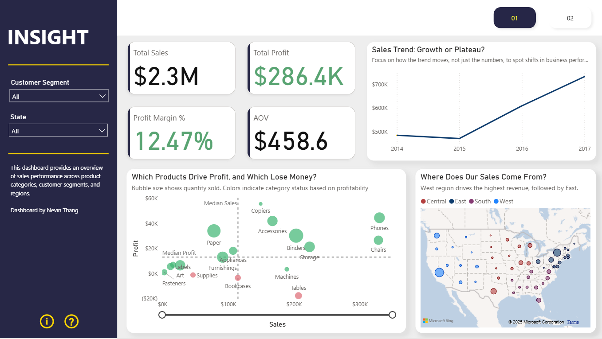
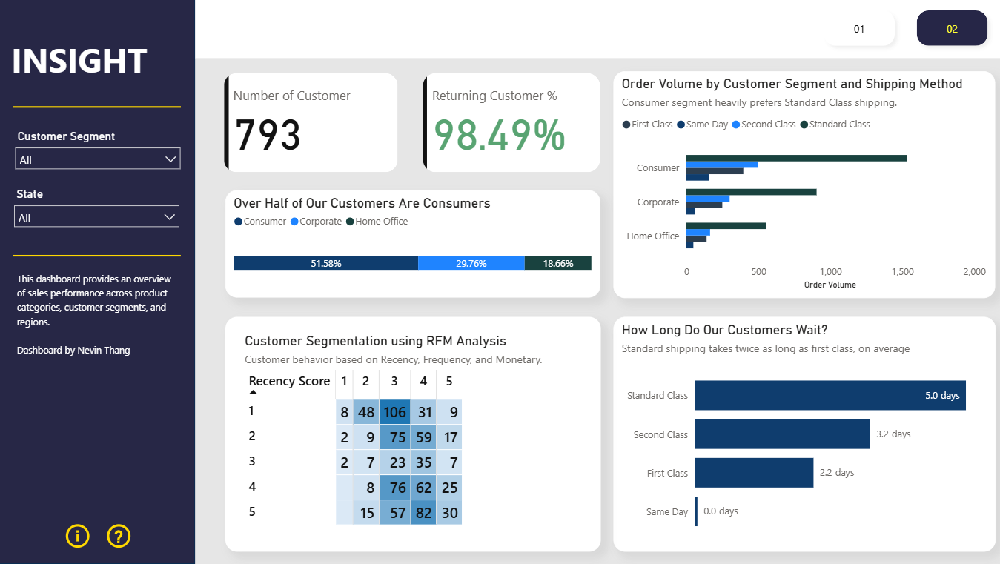

# 📊 INSIGHT – Sales Dashboard Project with Power BI

🚀 **View the interactive dashboard on Power BI Service**
📁 File: `sales_dashboard_project.pbix`

---

## 🔍 Introduction

**INSIGHT** is a sales analytics dashboard designed for both business executives and sales teams to monitor performance, identify key trends, and make data-driven decisions. Sales data often lives across different platforms and formats—this dashboard consolidates it all into one dynamic and user-friendly interface.

The project uses transactional data from sources to deliver insights on sales revenue, customer behavior, and product performance.

---

## 🛠️ Tools & Skills Used

- **🔸 DBeaver (PostgreSQL)**

  - Data querying, cleaning, and exporting using SQL

- **🔸 Microsoft Excel / CSV**

  - Data formatting, sanity checks, and preprocessing

- **🔸 Power BI**

  - Data transformation (Power Query)
  - Data modeling (relationships, calculated columns, DAX measures)
  - Visual storytelling and dashboard design

---

## 📄 Dashboard Structure

### 🧭 **Page 1: Executive & Sales Overview**

This page gives a high-level snapshot for stakeholders, focused on performance metrics such as:

- 📈 Total Revenue & Total Orders
- 🥇 Top Products by Sales & Profit
- 🗓️ Sales Trends
- 🌍 Regional Sales Map
- 📊 Category-wise breakdown

> Designed for quick understanding of "how the business is doing."

---

### 👥 **Page 2: Customer Analysis**

Drill deeper into customer behavior, loyalty, and value:

- 👤 Customer Overview
- 🧠 Customer Segmentation (RFM Analysis)
- 📆 Order Volume Breakdown
- 🚚 Delivery Insights

> Ideal for marketing, CRM, and customer engagement strategies.

---

## 💡 Highlights

- ✅ **Data Cleaning & Shaping** via Power Query
- 📊 **DAX Measures** for KPIs like Profit Margin, Avg. Order Value
- 🗺️ **Geospatial Mapping** for sales by location
- 🎯 **Interactive Filters** with slicers
- 🧩 Clean UI/UX layout optimized for usability

---

## 🧠 Conclusion

The **INSIGHT Dashboard** transforms raw sales and customer data into clear, actionable insights. Whether you're a business executive tracking KPIs or an analyst diving into customer data, this dashboard equips you to:

> **Make faster, better-informed, and impactful decisions.**

---
